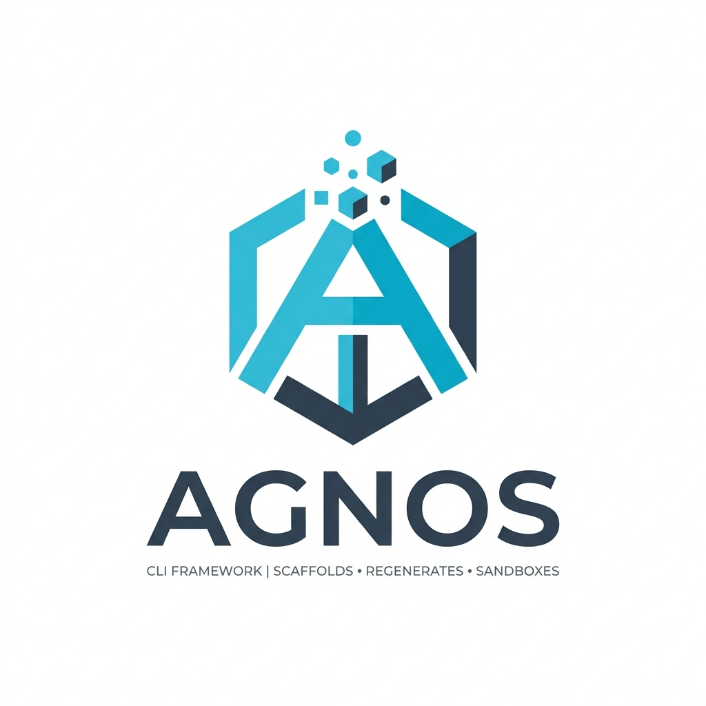

# agnos

[](https://pkg.go.dev/github.com/MateusMoutinhoOrg/Agnos)
[](https://github.com/MateusMoutinhoOrg/Agnos/releases/latest)
[](go.mod)
[](LICENSE)

A Go CLI that **scaffolds and regenerates other Go CLIs** — each one a closed, dependency-injected sandbox behind a command-line interface generated from declarations.

<p align="center">
  
</p>

> [!WARNING]
> **Under Development (Status: Pre-Beta)**
>
> - **Expected Beta:** end of October
> - **Expected Stable:** end of 2026
>
> From pre-beta on, breaking changes are avoided: a change to a declaration's schema, a command's flags, a public contract or the generated output keeps existing projects building, and one that cannot is named in its release notes. Patterns may still change before stable, so pin a version and read the release notes before upgrading.

---

## Overview

Agnos (`agnos`) is a **factory**. `agnos start` writes a project skeleton, `agnos build`
re-renders every generated file from templates embedded in the binary, and commands like
`add-command`, `add-flag` and `add-dep` declare the project's whole command surface
without a file being edited by hand. Only two things stay hand-written: a command's
`handler.go`, and any contract-plus-adapter pair of your own.

```
adapters/  ──▶  sandbox/  ◀──  cmd/
(reaches the OS)  (closed)     (wires the two together)
```

- **`/sandbox/`** — the closed core: actions, the generated dispatch, and the contracts
  everything is injected through. Reaches nothing outside itself.
- **`/adapters/`** — the only place OS-bound and third-party code lives.
- **`/assets/`** — the templates every generated file comes from, plus the installable deps.
- **`/cmd/main/`** — wires an adapter into the sandbox. Holds no logic.

Agnos builds itself: `agnos build` re-renders this repo in place and the result compiles.
Start with [Quickstart](docs/Quickstart/doc.md); the mechanics are in
[Structure](docs/Structure/doc.md) and [BuildPipeline](docs/BuildPipeline/doc.md).

## Installation

`agnos` is a single static binary, but every command that writes a project runs the Go
toolchain on it (`go mod tidy`, `go build`), so Go 1.25+ must be on `PATH`. Every platform's
block is in
[CliInstall](docs/CliInstall/doc.md).


## Documentation

### CliUsage

Driving agnos from a terminal - install, scaffold, declare commands, reference

| Doc | Description |
| --- | --- |
| [CliInstall](docs/CliInstall/doc.md) | Install agnos: a released binary per platform, or a build from source |
| [Quickstart](docs/Quickstart/doc.md) | Empty directory to a compiling CLI with one command, using only agnos commands |
| [Commands](docs/Commands/doc.md) | Every command of agnos, generated from the command declarations |
| [CliExamples](docs/CliExamples/doc.md) | Index of every runnable example of the agnos cli |
| [Interview](docs/Interview/doc.md) | The interactive session: the one screen written for a person, and what it offers when |

### LibUsage

Using Agnos as a Go module - deps injection, actions, public API

| Doc | Description |
| --- | --- |
| [LibUsage](docs/LibUsage/doc.md) | Use agnos as a Go module: wire the deps, build the sandbox, call its API |
| [PublicApi](docs/PublicApi/doc.md) | Every exported symbol of agnos, generated from the contract sources and their doc comments |
| [LibExamples](docs/LibExamples/doc.md) | Index of every runnable example of agnos as a Go module |

### Architecture

How the project is put together - layers, boundaries, data flow

| Doc | Description |
| --- | --- |
| [Adapters](docs/Adapters/doc.md) | Contract, adapter and binding: three units, one field of Deps, and who fills it |

### Development

Changing this repository - schema, build mechanics, recipes

| Doc | Description |
| --- | --- |
| [Requirements](docs/Requirements/doc.md) | The two tools this project needs — Go and agnos — installed per platform |
| [Workflow](docs/Workflow/doc.md) | Every change this project takes and the agnos command that makes it |
| [Rules](docs/Rules/doc.md) | Every rule the generators, `verify` and the hand-written files must hold to |
| [Structure](docs/Structure/doc.md) | The project schema: what lives where, what is generated, what verify enforces |
| [BuildPipeline](docs/BuildPipeline/doc.md) | What build does: verify, collectors, template vars, asset groups, StagedFS persist, runtime, dispatch |
| [Contributing](docs/Contributing/doc.md) | Recipes specific to changing agnos itself: bootstrap, actions, installable deps, templates, collectors, declaration packages |
| [Plan](docs/Plan/doc.md) | future plans of the project |

### Reference

Lookup tables - schemas, file formats, generated file listings

| Doc | Description |
| --- | --- |
| [CommandYaml](docs/CommandYaml/doc.md) | Every key of a command's command.yaml and what the generated code does with it |
| [Extensions](docs/Extensions/doc.md) | The generation mechanics this project turns on, and what each one writes |
| [DepList](docs/DepList/doc.md) | Every dep `agnos add-dep` can add, the adapters that fill it, and what backs each one |
| [GeneratedFiles](docs/GeneratedFiles/doc.md) | Every file agnos writes into this project and whether build overwrites it |

## License

MIT License

Copyright (c) 2026 Mateus Moutinho

Permission is hereby granted, free of charge, to any person obtaining a copy
of this software and associated documentation files (the "Software"), to deal
in the Software without restriction, including without limitation the rights
to use, copy, modify, merge, publish, distribute, sublicense, and/or sell
copies of the Software, and to permit persons to whom the Software is
furnished to do so, subject to the following conditions:

The above copyright notice and this permission notice shall be included in all
copies or substantial portions of the Software.

THE SOFTWARE IS PROVIDED "AS IS", WITHOUT WARRANTY OF ANY KIND, EXPRESS OR
IMPLIED, INCLUDING BUT NOT LIMITED TO THE WARRANTIES OF MERCHANTABILITY,
FITNESS FOR A PARTICULAR PURPOSE AND NONINFRINGEMENT. IN NO EVENT SHALL THE
AUTHORS OR COPYRIGHT HOLDERS BE LIABLE FOR ANY CLAIM, DAMAGES OR OTHER
LIABILITY, WHETHER IN AN ACTION OF CONTRACT, TORT OR OTHERWISE, ARISING FROM,
OUT OF OR IN CONNECTION WITH THE SOFTWARE OR THE USE OR OTHER DEALINGS IN THE
SOFTWARE.

